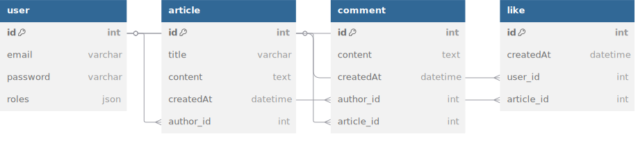

# Mini CMS Symfony

## Table des matières

- [Équipe](#-équipe)
- [Lancer le projet](#-lancer-le-projet)
- [Modèle Conceptuel de Données (MCD)](#-modèle-conceptuel-de-données-mcd)
- [Remarques](#-remarques)
- [Références](#-références)
- [Configuration de l'environnement](#-configuration-de-lenvironnement)

---

## Équipe

- Issa Madayev

---

## Lancer le projet

1. Installer les dépendances PHP :

```bash
composer install
```

2. Copier le fichier d'environnement :

```bash
cp .env .env.local
```

3. Créer la base de données :

```bash
php bin/console doctrine:database:create
php bin/console doctrine:migrations:migrate
```

4. Lancer le serveur Symfony :

```bash
symfony serve
```

5. Accéder à l'application :
[http://localhost:8000]
---

## Modèle Conceptuel de Données (MCD)

### Diagramme UML



#### Entités principales :

- **User** (id, email, password, roles)
- **Article** (id, title, content, createdAt, author)
- **Comment** (id, content, createdAt, author, article)
- **Like** (id, user, article, createdAt)

---

## Remarques

- Bonne prise en main du système d'authentification de Symfony
- La gestion des rôles (`ROLE_ADMIN`, `ROLE_USER`) a été testée manuellement
- Le système de like/unlike m'a permis d'utiliser les collections inversées (`OneToMany`)
- La sécurité sur les actions est gérée avec `isGranted` + vérification manuelle de l'auteur
- Enormément de problème de config qui m'ont pris tout mon temps sur ce projet

---

## Références
- [Symfony Docs – Authentification](https://symfony.com/doc/current/security.html)  
  Pour la mise en place de `make:auth`, `make:registration-form`, la gestion des rôles et de la sécurité.

- [Symfony Routing (attributs PHP 8+)](https://symfony.com/doc/current/routing.html#using-attributes)  
  Pour structurer les routes avec `#[Route(...)]` dans les contrôleurs.

- [Symfony Forms](https://symfony.com/doc/current/forms.html)  
  Pour créer et gérer les formulaires `Article`, `Comment` et `Like`.

- [Symfony Doctrine ORM](https://symfony.com/doc/current/doctrine.html)  
  Pour la gestion des entités, les relations (`OneToMany`, `ManyToOne`), les migrations, etc.

- [Twig – Documentation officielle](https://twig.symfony.com/doc/)  
  Pour le rendu des vues : boucles `for`, filtres (`date`, `length`), `is_granted`, etc.

- [Symfony Flash Messages](https://symfony.com/doc/current/controller.html#flash-messages)  
  Pour afficher des messages d'alerte (erreurs, succès, etc.) après une action.

- [Doctrine Collections – `filter()`](https://www.doctrine-project.org/projects/doctrine-collections/en/1.6/index.html)  
  Utilisé pour détecter si un utilisateur a déjà liké un article.

- [OWASP – Session Fixation & Hijacking](https://owasp.org/www-community/attacks/Session_fixation)  
  Pour la veille technique sur les attaques de session et leurs protections.

- [dbdiagram.io](https://dbdiagram.io/home)  
  Pour générer un MCD propre.

- [Documentation officielle de Symfony](https://symfony.com/doc)

- [Symfonycasts](https://symfonycasts.com/)

- [Twig](https://twig.symfony.com/doc/)

- [Doctrine ORM](https://www.doctrine-project.org/projects/orm.html)

- [Bootstrap](https://getbootstrap.com/)

- [StackOverflow](https://stackoverflow.com - https://stackoverflow.com/questions/66626974/symfony-5-an-exception-occurred-in-driver-could-not-find-driver/79606501#79606501 Merci ce bogoss qui a debloqué la première partie de mes problèmes de config)

- ChatGPT qui n'a au final pas du tout aider dans mes problèmes de config mais je mets quand même

- Cours et supports de MyDigitalSchool