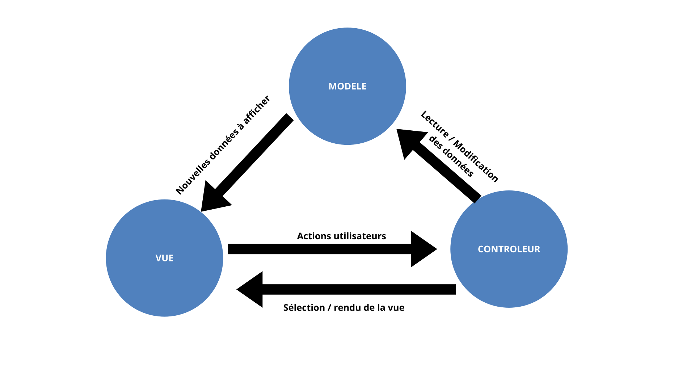
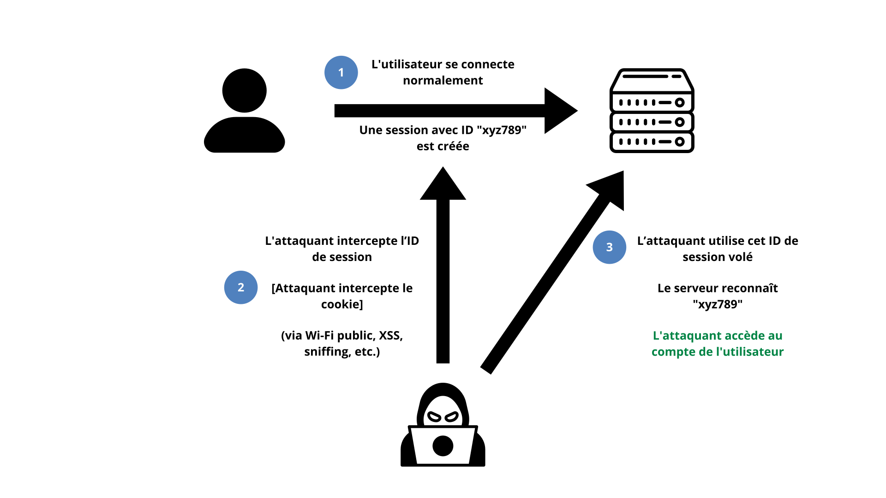
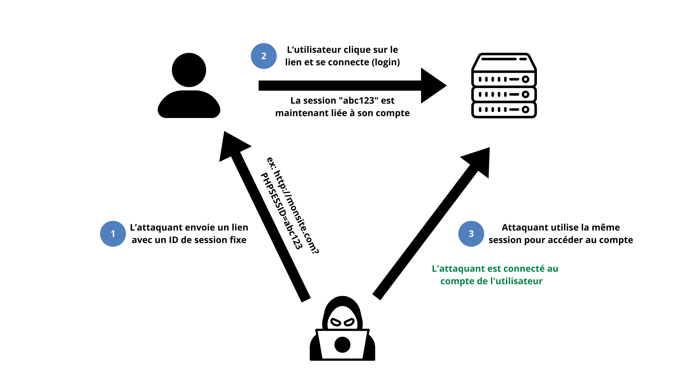

1. Réaliser un schéma du pattern MVC au format svg. Indiquer les dépendances entre composants.

### Schéma du pattern MVC

Ce schéma illustre les interactions entre les composants principaux :
- **Contrôleur** : reçoit les actions utilisateurs, sélectionne la vue, met à jour le modèle
- **Modèle** : contient les données métier, notifie les changements
- **Vue** : affiche les données et les changements

Les dépendances entre composants sont représentées par les flèches.

2. Qu’est-ce qu’une session dans une application web ?
Une session est un mécanisme permettant de conserver des données entre plusieurs requêtes HTTP pour un utilisateur donné.
Elle fonctionne en stockant un identifiant de session unique (souvent dans un cookie) sur le navigateur de l’utilisateur, et les données associées sont conservées côté serveur.
En PHP/Symfony, cela permet par exemple de savoir si un utilisateur est connecté, ou de stocker des informations temporaires comme un panier d’achat.

3. Session Hijacking
Définition
Le session hijacking (ou détournement de session) est une attaque où un pirate intercepte ou vole un identifiant de session valide pour se faire passer pour l'utilisateur légitime.
Cela permet d’accéder aux données de l’utilisateur sans avoir à se connecter.

Moyens de protection
Forcer l’usage de HTTPS (TLS)

Regénérer l’ID de session régulièrement (session_regenerate_id() en PHP)

Lier la session à des informations du client (ex : IP, user agent)

Définir des délais d’expiration courts

### 📄 Schéma illustratif – Session Hijacking

3. Session Fixation

Définition
Le session fixation est une attaque où le pirate oblige la victime à utiliser une session dont l’identifiant est déjà connu ou contrôlé par le pirate.
Une fois la victime connectée, l’attaquant peut récupérer la session, car il en connaissait déjà l’identifiant.

Moyens de protection

Regénérer l’ID de session après authentification

Refuser les identifiants de session transmis par l’URL

Empêcher l’utilisateur de définir manuellement un ID de session

### 📄 Schéma illustratif – Session Fixation

